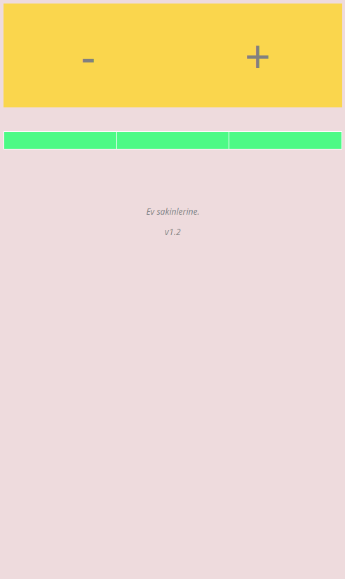
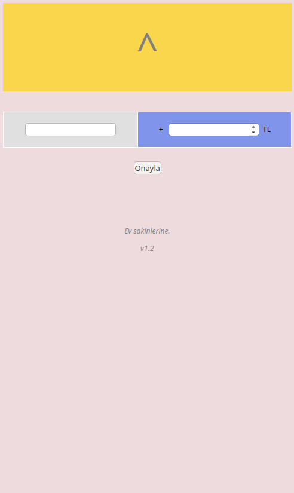
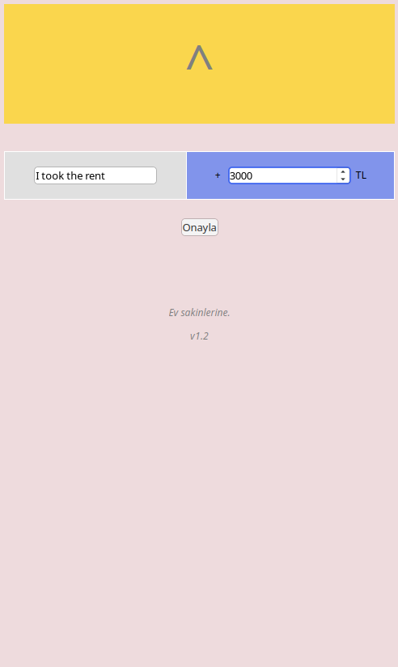
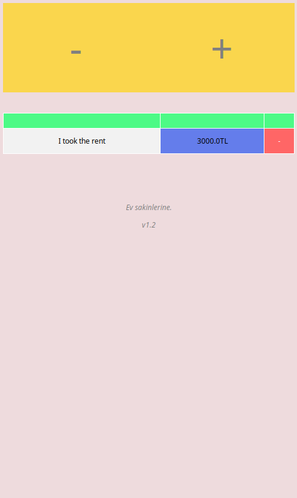
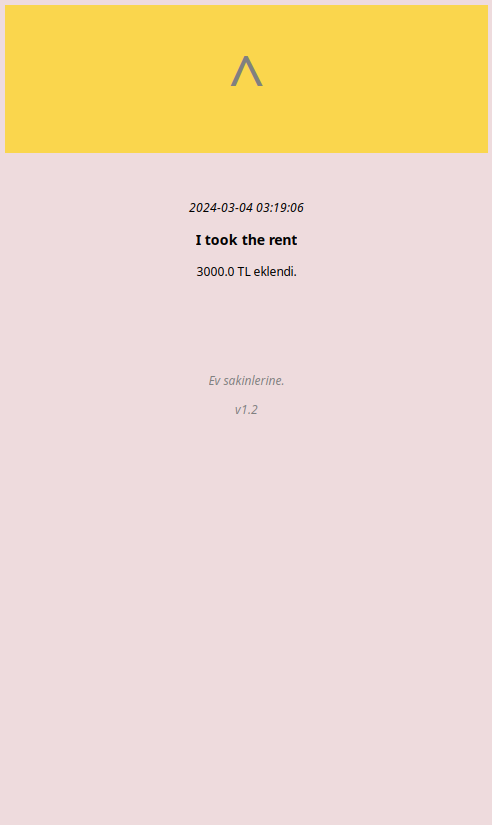
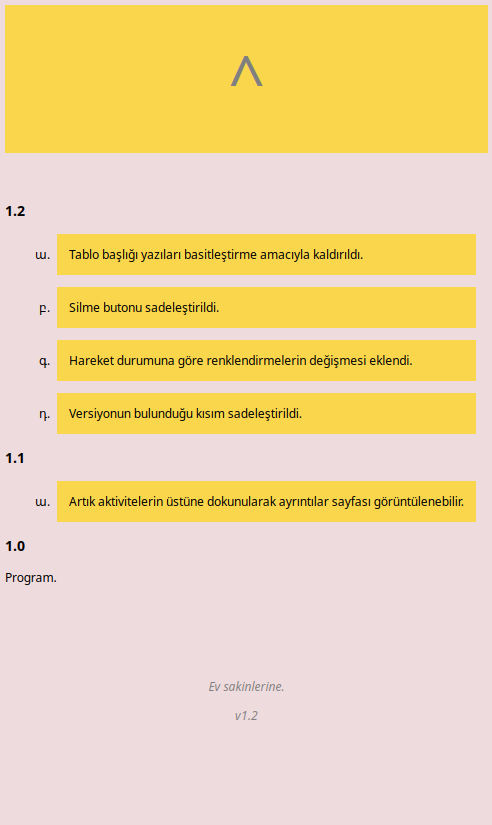

# NowayBankrupt
NowayBankrupt is a solution to the problem of hardware based "money tracking programs".
It is a website. So from any device that can reach to the website, app could be used like
a charm. Okay, okay. No more ADs. It's just a website to use in my home with my
family to track our money all together. 
It's a really simple flask application. I mean REALLY simple. And I'm proud of
this simplicity.

  This project is based on a minimalistic design. A big yellow button scheme on top, and other schemes on bottom.
I made the design as simple as possible. Website is based on Turkish language originally but it could be translated easily.
It does have at most two sentences(approximately three words) except version logs.

## Start Up
Firstly a tip: This app is working best on horizontal display. So, I recommend a experiment with a 
verticular browser.

A virtual environment and flask library is needed to starting up the project, and Python. If you
need help about how to create a virtual environment, go ahead and look at this page:
[Flask Installation and Setting Up Tutorial](https://flask.palletsprojects.com/en/3.0.x/installation/#virtual-environments)

When venv is started and the flask is up, go to the ip address from your best browser.
There's the app.

```bash
. venv/bin/activite
flask --app application run --host {local ip address here}
```
## Usage
It is simple. There is a yellow button bar on top for doing main stuff.
And in the bottom, page specific stuff.



In index page, you should see two buttons in button bar, that a minus and plus.
One is for adding a "money increase log" and one is for "money deacrease log".
Can you guess witch one is witch? Click one of them. 




Now you're in the "action" page. Left one is title, and right one is amount of 
money. Type something to there. 



And click the button at a bit down of text boxes. 



Now you'll back on the index page. Based on your log type, there will be 
a color. And that color will be more colorful if amount of money is high, 
or will be more close to white if amount of money is low. 
If you didn't liked your log, tap the button at the right side of your log. 
That would destroy your log. But in the case of liking the log, you can tap 
directly at your log and see its details.



And finally, at bottom of every page, you'll see the version number. If you tap
it, you'll gonna be directed to version logs.


